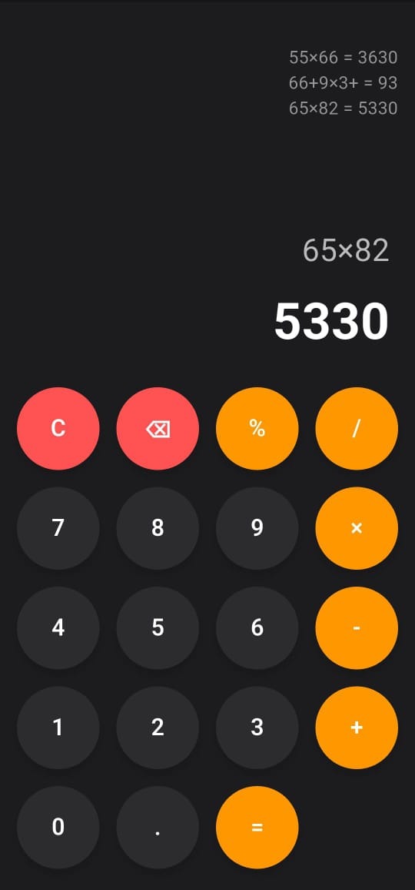

# 📱 Aplikasi Kalkulator Flutter

Aplikasi kalkulator sederhana dengan tampilan modern yang dibuat menggunakan **Flutter**.  
Mendukung operasi aritmatika dasar, persentase, perhitungan berantai, dan dilengkapi dengan **riwayat perhitungan**.

---

## ✨ Fitur
- 🧮 Operasi dasar: tambah, kurang, kali, bagi, persen
- 🔗 Perhitungan berantai (menggunakan hasil sebelumnya untuk perhitungan selanjutnya)
- 📜 Riwayat perhitungan bergulir
- 🎨 Tampilan dark mode yang modern dengan tombol bulat
- ⚡ Performa ringan dan responsif

---

## 📸 Tangkapan Layar

---

## 🚀 Cara Pakai

Cara pakenya? gampang banget! 😁

1. **Kloning repo ini dulu**
   ```bash
   git clone https://github.com/RifaAmrilSahputra/kalkulator-flutter.git
   cd kalkulator-flutter
   ```

2. **Ambil semua dependency yang dibutuhkan**
   ```bash
   flutter pub get
   ```

3. **Jalankan Aplikasi**
   ```bash
   flutter run
   ```

Dan beehh 🎉 langsung jalan kalkulator nya di emulatormu!. 
Gampang kan, gampang lah, masa gak.
